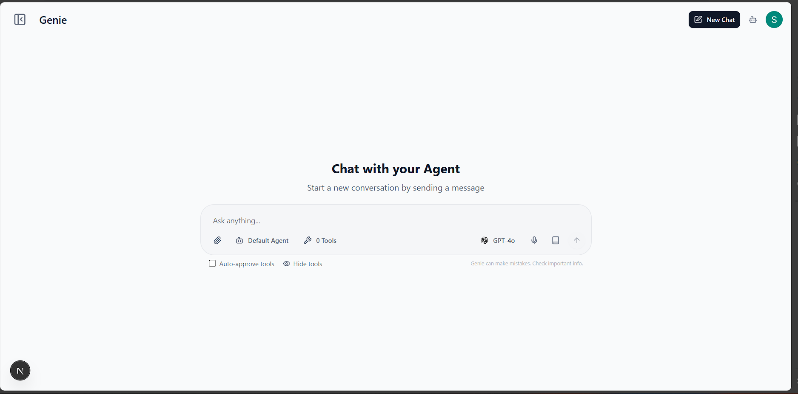
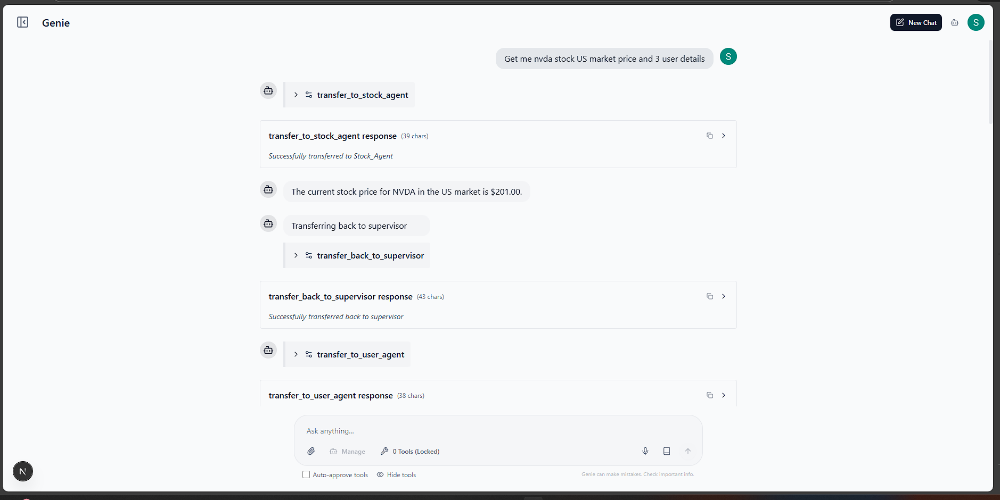
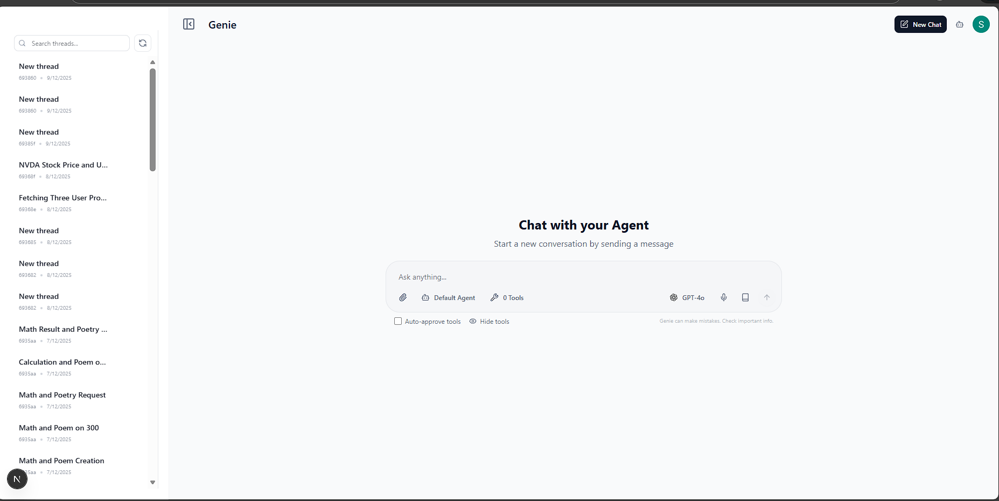
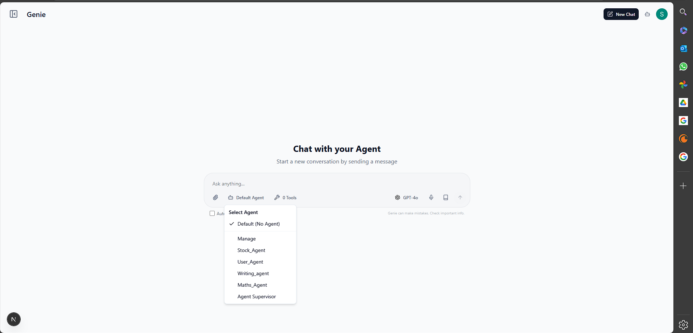
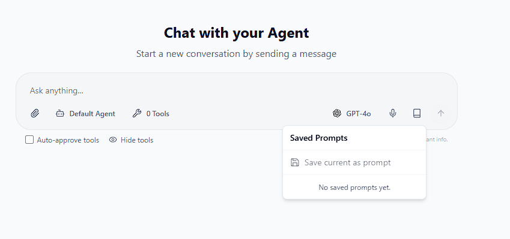
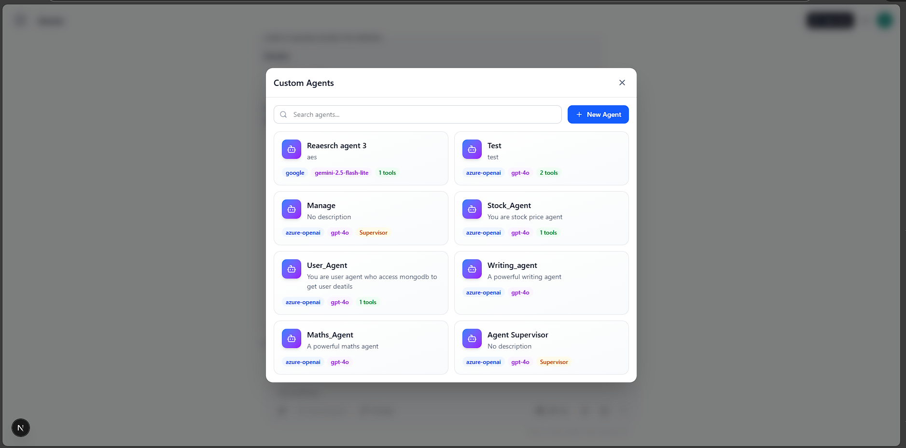
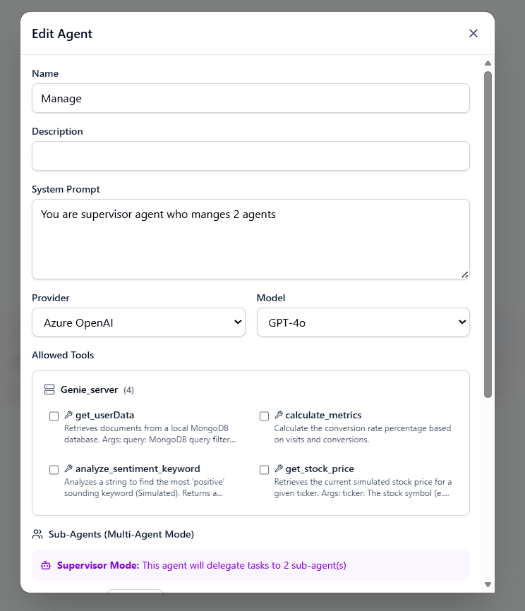
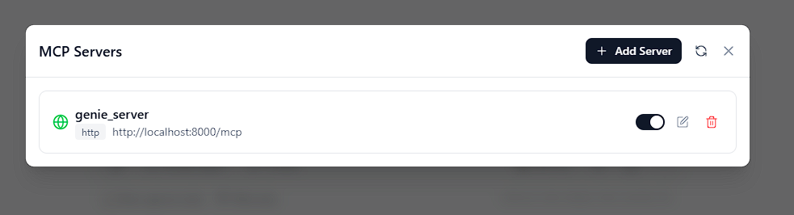
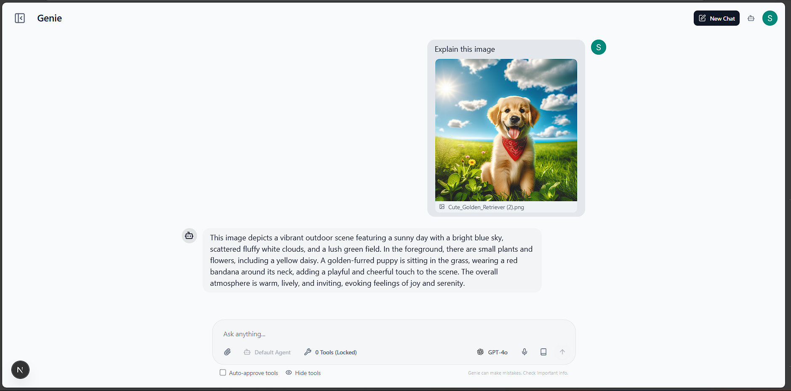
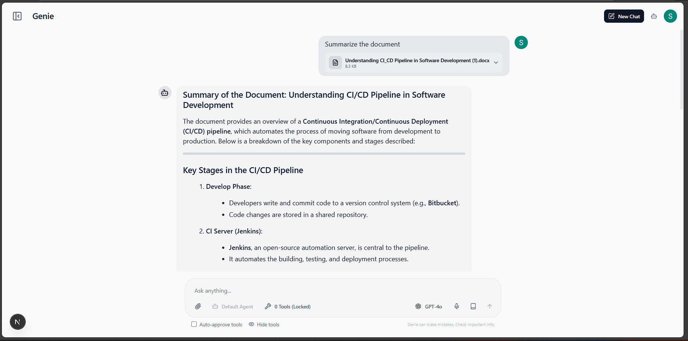

# GENIE - AI Agent Framework with LangGraph & MCP


> **Build powerful AI agents using LangGraph.js, LangChain, and Model Context Protocol (MCP).**
>
> GENIE is a production-ready full-stack framework for creating intelligent AI applications. It combines **Next.js 15** with **LangGraph.js** for frontend agent orchestration, and a **Python FastMCP server** with **50+ built-in tools** including calculators, converters, visualizations, and developer utilities.

## 🎯 Why GENIE?

- **Multi-Model Support**: Works with **Google Gemini**, **OpenAI GPT-4**, **Anthropic Claude**, and any LangChain-compatible LLM
- **50+ MCP Tools**: Pre-built utilities for calculations, data conversion, web tools, code analysis, and interactive charts
- **Interactive Visualizations**: Pie charts, bar charts, line graphs, and QR codes render directly in chat
- **Multi-Agent Architecture**: Supervisor pattern with LangGraph for orchestrating specialized sub-agents
- **Enterprise Auth**: NextAuth.js with Google OAuth, Azure AD, and customizable providers
- **MongoDB Integration**: Built-in database tools for querying and storing data
- **Extensible**: Easy to add custom MCP tools and new AI agents

## 📂 Project Structure

The project is divided into two main components:

- **`genie_client/`**: Next.js 15 frontend with LangGraph.js, LangChain, TanStack Query, and Tailwind CSS
- **`genie_server/`**: Python backend with FastMCP, MongoDB integration, and 50+ utility tools

## ✨ Key Features

### 🔐 Authentication

Secure user authentication is implemented using **NextAuth.js**, supporting multiple providers:

- **Google OAuth**: Easy login with Google accounts.
- **Azure AD**: Enterprise-grade authentication.
- **Customizable**: additional providers can be added in `app/api/auth/[...nextauth]/route.ts`.

### 🔌 Model Context Protocol (MCP) Integration

The project fully embraces the **Model Context Protocol** for standardized tool usage:

- **FastMCP Server**: The `genie_server` runs a FastMCP instance (`server.py`) exposing 50+ production-ready tools.
- **Tool Selection**: The frontend (LangGraph agent) dynamically discovers and selects these MCP tools to fulfill user requests, enabling a decoupled and extensible architecture.
- **Interactive Visualizations**: Charts (pie, bar, line, doughnut) and QR codes render inline in chat responses.

#### 📊 Available MCP Tools

<details>
<summary><b>🔢 Analytics Tools</b></summary>

| Tool                        | Description                                           |
| --------------------------- | ----------------------------------------------------- |
| `calculate_metrics`         | Calculate conversion rate from visits and conversions |
| `analyze_sentiment_keyword` | Analyze text for positive sentiment keywords          |

</details>

<details>
<summary><b>💰 Finance Tools</b></summary>

| Tool              | Description                                   |
| ----------------- | --------------------------------------------- |
| `get_stock_price` | Get simulated stock price for a ticker symbol |

</details>

<details>
<summary><b>🗄️ Data Tools</b></summary>

| Tool           | Description                               |
| -------------- | ----------------------------------------- |
| `get_userData` | Query MongoDB database for user documents |

</details>

<details>
<summary><b>📈 Visualization Tools</b></summary>

| Tool                        | Description                                         |
| --------------------------- | --------------------------------------------------- |
| `generate_pie_chart`        | Create interactive pie chart with labels and values |
| `generate_bar_chart`        | Create vertical/horizontal bar chart                |
| `generate_line_chart`       | Create multi-series line chart for trends           |
| `generate_doughnut_chart`   | Create doughnut chart (pie with center hole)        |
| `generate_comparison_chart` | Create grouped bar chart comparing two datasets     |

</details>

<details>
<summary><b>🛠️ Utility Tools</b></summary>

| Tool                        | Description                                            |
| --------------------------- | ------------------------------------------------------ |
| `generate_password`         | Generate secure random password with strength analysis |
| `generate_uuid`             | Generate UUID v1 (time-based) or v4 (random)           |
| `hash_text`                 | Hash text using MD5, SHA1, SHA256, or SHA512           |
| `encode_base64`             | Encode text to Base64 or decode Base64 to text         |
| `word_count`                | Get word count, reading time, and text statistics      |
| `calculate_percentage`      | Calculate what percentage a value is of total          |
| `calculate_discount`        | Calculate discount amount and final price              |
| `calculate_tip`             | Calculate tip with optional bill splitting             |
| `calculate_bmi`             | Calculate Body Mass Index from weight/height           |
| `calculate_loan`            | Calculate monthly payment and total interest           |
| `convert_temperature`       | Convert between Celsius, Fahrenheit, Kelvin            |
| `convert_length`            | Convert between metric and imperial length units       |
| `convert_weight`            | Convert between metric and imperial weight units       |
| `convert_data_size`         | Convert between B, KB, MB, GB, TB, PB                  |
| `get_current_datetime`      | Get current date/time with timezone offset             |
| `calculate_date_difference` | Calculate days/weeks/months between two dates          |
| `add_days_to_date`          | Add or subtract days from a date                       |
| `format_json`               | Prettify and validate JSON strings                     |
| `generate_lorem_ipsum`      | Generate placeholder Lorem Ipsum text                  |

</details>

<details>
<summary><b>🌐 Web Tools</b></summary>

| Tool               | Description                                      |
| ------------------ | ------------------------------------------------ |
| `parse_url`        | Parse URL into components (domain, path, params) |
| `build_url`        | Build URL from base, path, and query params      |
| `encode_url`       | URL encode or decode strings                     |
| `extract_emails`   | Extract all email addresses from text            |
| `extract_urls`     | Extract all URLs from text                       |
| `validate_email`   | Validate email format with detailed feedback     |
| `generate_qr_data` | Generate QR code data (renders in UI)            |
| `extract_hashtags` | Extract #hashtags from text                      |
| `extract_mentions` | Extract @mentions from text                      |
| `analyze_domain`   | Analyze domain name (TLD, subdomain, etc.)       |
| `slugify`          | Convert text to URL-friendly slug                |

</details>

<details>
<summary><b>💻 Developer Tools</b></summary>

| Tool                       | Description                                       |
| -------------------------- | ------------------------------------------------- |
| `test_regex`               | Test regex pattern and show all matches           |
| `convert_color`            | Convert between HEX, RGB, and HSL formats         |
| `generate_color_palette`   | Generate complementary/analogous/triadic palettes |
| `escape_string`            | Escape for HTML, JSON, regex, SQL, or URL         |
| `diff_text`                | Compare two texts and show differences            |
| `minify_json`              | Minify JSON by removing whitespace                |
| `count_code_lines`         | Count code, comment, and blank lines              |
| `generate_color_from_text` | Generate consistent color from any text           |

</details>

### 📝 Prompt Management

- **Save & Reuse**: Users can save their current chat context or specific instructions as reusable prompts.
- **Database Storage**: Prompts are stored in the database for easy retrieval and management via the `PromptSaveDialog`.

### 🤖 Multi-Agent & Custom Agent Chat

- **Supervisor Pattern**: Uses `langgraph-supervisor` to orchestrate a team of specialized sub-agents.
- **Custom Agents**: Users can define and configure custom sub-agents with specific system prompts, models, and allowed tools.
- **Intelligent Routing**: The supervisor agent analyzes user queries and routes them to the most appropriate sub-agent(s) for handling.

### 📄 Document & Image Analysis

- **File Uploads**: Supports uploading various file types via the `api/upload` endpoint.
- **Image Analysis**: Images are processed (base64 encoded) and passed to vision-capable models for analysis.
- **Document Parsing**: Text is extracted from documents (PDF, DOCX, etc.) to provide context for the AI agents.

## � Screenshots













## �🚀 Getting Started

Follow these instructions to set up and run the project locally.

### Prerequisites

Ensure you have the following installed:

- **Node.js** (v18+ recommended)
- **pnpm** (Package manager)
- **Python** (v3.10+)
- **MongoDB** (Running locally on default port `27017`)

---

### 🐍 Backend Setup (genie_server)

1.  Navigate to the server directory:

    ```bash
    cd genie_server
    ```

2.  Create and activate a virtual environment:

    ```bash
    # Windows
    python -m venv .venv
    .venv\Scripts\activate

    # macOS/Linux
    python3 -m venv .venv
    source .venv/bin/activate
    ```

3.  Install dependencies:

    ```bash
    pip install -r requirements.txt
    ```

4.  Start the MCP server:
    ```bash
    python server.py
    ```
    _The server acts as a streamable MCP server (HTTP/SSE)._

---

### ⚛️ Frontend Setup (genie_client)

1.  Navigate to the client directory:

    ```bash
    cd genie_client
    ```

2.  Install dependencies:

    ```bash
    pnpm install
    ```

3.  Set up environment variables:

    - Duplicate `.env.example` to `.env`.
    - Configure your API keys (Google GenAI, OpenAI, etc.) as needed.

4.  Run the development server:

    ```bash
    pnpm dev
    ```

5.  Open [http://localhost:3000](http://localhost:3000) in your browser to see the application.

### 🔌 MCP Configuration

To connect the frontend to the backend MCP server:

1.  Open the application at `http://localhost:3000`.
2.  Click the **settings icon** and "Configure MCP" in the header to open the MCP Server list.
3.  Click **"Add Server"** and enter the following details:
    - **Name**: `Genie Server` (or any name you prefer)
    - **Type**: `http`
    - **URL**: `http://localhost:8000/mcp`
4.  Click **"Save"**. The client will now be able to discover and use the tools defined in `genie_server/server.py`.

### Example MCP Server Configurations

#### Next.js MCP Server (stdio)

```json
{
  "mcpServers": {
    "next-devtools": {
      "type": "stdio",
      "command": "npx",
      "args": ["-y", "next-devtools-mcp@latest"]
    }
  }
}
```

#### HTTP API Server (genie_server)

```json
{
  "mcpServers": {
    "genie-server": {
      "type": "http",
      "url": "http://localhost:8000/mcp"
    }
  }
}
```

> [!NOTE]
> The MCP tools in `genie_server/app/tools/` provide production-ready functionality including calculators, converters, text analysis, visualization, and developer utilities. You can extend them with your own business logic or integrations.

## 🛠️ Tech Stack

### Client

- **Framework**: [Next.js 15](https://nextjs.org/) (App Router)
- **AI Orchestration**: [LangGraph.js](https://langchain-ai.github.io/langgraphjs/) & [LangChain](https://js.langchain.com/)
- **Styling**: [Tailwind CSS](https://tailwindcss.com/) & [Shadcn UI](https://ui.shadcn.com/)
- **State Management**: [TanStack Query](https://tanstack.com/query/latest)

### Server

- **Core**: Python
- **Protocol**: [Model Context Protocol (MCP)](https://modelcontextprotocol.io/) via `FastMCP`
- **Database**: [MongoDB](https://www.mongodb.com/) (via `pymongo`)

## � Acknowledgements

Special thanks to the following projects for their base code and inspiration:

- [LangChain UI](https://docs.langchain.com/oss/python/langchain/ui)
- [Fullstack LangGraph Next.js Agent](https://github.com/IBJunior/fullstack-langgraph-nextjs-agent)
